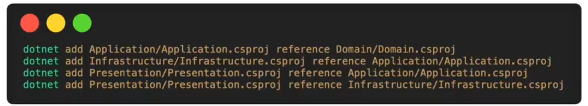

## Clean Architecture in dotnet API Template
**Notes:** *This is not a complete document about this project, be advice that this project is still in rapid development*

### About
Reference for a clean architecture implementation for dotnet API 


| Name | Diagram |
| --- | --- |
| Architecture diagram |  |
| Adding reference CLI |  |

### Folder Structure Explaination & Hierarchy
<details>
	<summary>API</summary>

- **Controller**
</details>

<details>
	<summary>Contracts</summary>

Only connected to API layer. Mainly model for request and response

</details>

<details>
	<summary>Application</summary>

Application folder contains anything that specifically related to the project
- **Common**
	- **Interface**
		- **Auth**
		- **Persistence**
			An interface layer to SAVE and RETRIEVE items that your application uses
		- **Services**
			An interface for any services inside the Infrastructure layer. ***Refer to Infrastucture***
- **Services**
	All the main services that is specically related to the core project.
- **DependencyInjection.cs**
		Not a folder, but a must have file. Something like:

```cs
		public static class DependencyInjection
		{
			public static IServiceCollection AddApplication(this IServiceCollection services, ConfigurationManager configuration)
			{
				return services;
			}
		}
```
</details>

<details>
	<summary>Infrastructure</summary>

- **Auth**
	Auth related method, the interface will be in *Application/Common/Interface/Auth*
- **Persistence**
	Mainly repositories for the overall application
- **Services**
		Just a very basic service in general that does not specifically related to the actual project domain
- **DependencyInjection.cs**
		Not a folder, but a must have file. Something like:

```cs
		public static class DependencyInjection
		{
			public static IServiceCollection AddInfrastructure(this IServiceCollection services, ConfigurationManager configuration)
			{
				return services;
			}
		}
```

</details>
<details>
	<summary>Domain</summary>

Only domain related only. Mainly Models.

</details>